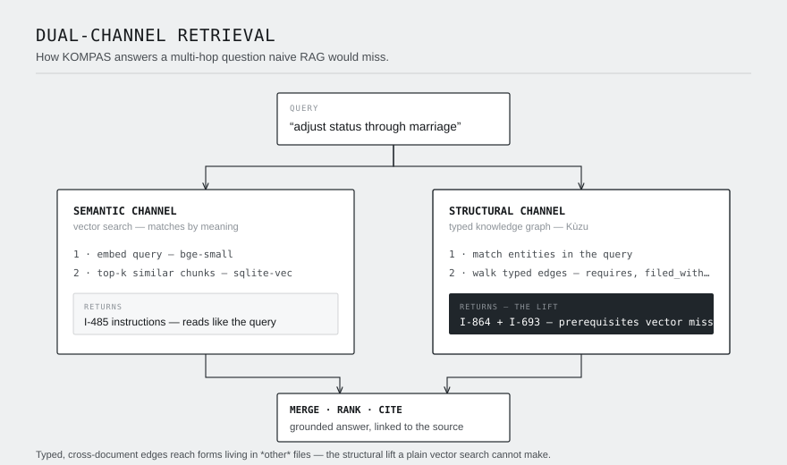
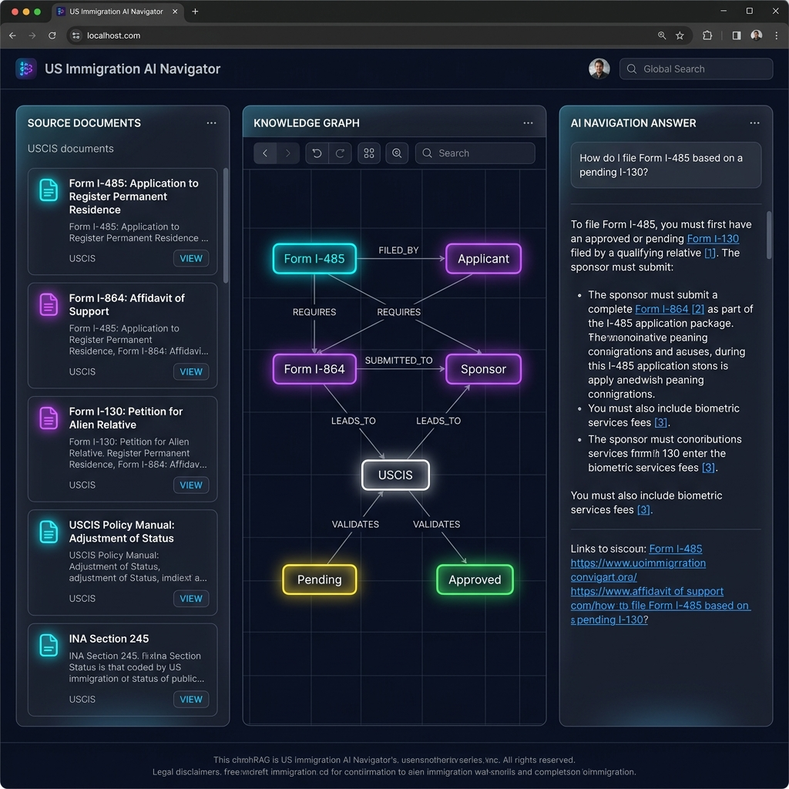

# GraphRAG — Jurisdiction-Aware Regulatory Navigator

**Ask a messy regulatory corpus a hard, multi-step question and get a citation-grounded answer — plus the reasoning path that produced it.**

This reference implementation is pointed at **US immigration forms** (USCIS forms + instruction booklets: I-130, I-485, I-864, I-693, I-765, I-131, I-140, I-907, I-129). But nothing in the pipeline is immigration-specific — point it at any folder of regulatory PDFs/HTML and it will build a knowledge graph and answer questions over it.

---

## Why this beats naive RAG

Ordinary RAG embeds your question, pulls the top-k most similar text chunks, and asks an LLM to answer. It fails on **multi-hop procedural questions** where the answer spans several documents that don't all look like the question.

> *"I'm adjusting status through marriage — which forms and documents do I need?"*

A vector search for that finds the **I-485** instructions. It does **not** obviously surface that you also need an **I-864 Affidavit of Support** and an **I-693 medical exam** — those live in *other* documents and the query never mentions "financial support" or "medical."

This system runs **dual-channel retrieval**:

1. **Semantic channel** — vector similarity over text chunks (`sqlite-vec` + `bge-small`).
2. **Structural channel** — a **typed knowledge graph** (`Kùzu`). Entities (forms, agencies, benefits, eligibility conditions, evidence, statutes) are linked by **typed, directed edges** extracted from the text: `I-485 —requires→ I-864`, `I-485 —requires→ I-693`, `I-131 —requires→ I-130`. From the entities in your question we walk the graph 1–2 hops and pull in the chunks those connected forms come from.

Because the graph edges are **typed and cross-document**, the structural channel surfaces prerequisite forms that the semantic channel misses. That is the entire innovation claim — and it's **measured** (below), not asserted.

> **Design note:** an earlier iteration used *co-occurrence* edges (link any two entities sharing a chunk). That largely recovers what vector search already finds and produces a near-zero delta. The win comes specifically from **schema-guided typed relations** that encode procedural logic across documents.

---

## Results (hybrid vs. naive baseline)

28 hand-built questions (20 multi-hop), `top_k=8`, `graph_hops=2`. Reproduce with `python -m backend.eval.run_eval`.

| Metric | Naive RAG | Hybrid GraphRAG | Δ |
|---|---:|---:|---:|
| Retrieval recall@k (gold forms in retrieved context) | 0.818 | **0.902** | **+0.083** |
| Source-doc recall (gold form's own doc retrieved) | 0.780 | **0.833** | **+0.054** |
| Answer accuracy (gold forms named in answer) | 0.917 | **0.935** | +0.018 |
| Citation precision (citations on gold documents) | 0.701 | 0.688 | −0.013 |

**Multi-hop subset (20 questions):** retrieval recall **+0.067**, source-doc recall **+0.075**.

Where it matters most, the difference is decisive — e.g. *"Which form speeds up an H-1B petition?"* and *"What underlying petition does I-485 require?"* go from naive retrieval recall **0.00 → 1.00** and **0.50 → 1.00** because the prerequisite form only exists in a document the graph reaches.

**Honest reading of the table:** the retrieval-level metrics are the clean signal — they measure the retriever directly. The *answer-accuracy* delta is smaller because the generation LLM sometimes names a form from its own parametric memory even when retrieval missed it; that helps the product but compresses the measured gap. Citation precision is ~flat: the graph trades a little precision for recall, as expected. Numbers were **not** tuned to inflate the delta.

---

## Architecture



```
              ┌─────────────┐
  PDFs/HTML → │  Ingestion  │  PyMuPDF/BS4 → heading-aware chunks → boilerplate filter
              └──────┬──────┘
                     ▼
      ┌──────────────────────────────┐
      │  Schema-guided extraction     │  LLM → {entities, typed relations} per chunk
      │  (Groq, provider-swappable)   │  requires / filed_with / evidence_for /
      └───────┬───────────────┬───────┘  eligibility_for / references / supersedes / applies_to
              ▼               ▼
   ┌──────────────┐   ┌────────────────────┐
   │  Vector DB   │   │   Knowledge graph   │   entities deduped across documents
   │ sqlite-vec   │   │   Kùzu (typed RELATES)│ → cross-doc edges
   └──────┬───────┘   └──────────┬─────────┘
          └────────┬─────────────┘
                   ▼
        ┌─────────────────────┐
        │  Hybrid retriever    │  vector top-k  +  budgeted k-hop graph traversal
        │  (dual-channel)      │  (hub-aware, max-node capped)
        └──────────┬──────────┘
                   ▼
        ┌─────────────────────┐
        │  Citation generator  │  Groq, citation-enforcing prompt + graph reasoning path
        └──────────┬──────────┘
                   ▼
          FastAPI  →  Next.js UI (answer + citations + typed graph viz)
```

**Stack** (8 GB / Windows friendly, no GPU): PyMuPDF · sqlite-vec · `bge-small` (ONNX, no torch needed for serving) · Kùzu (embedded) · Groq/Cerebras/Gemini (swappable, with rate-limit fallback) · FastAPI · Next.js + React Flow.

---

## Quickstart

**Prereqs:** Python 3.11+, Node 18+. Get a free [Groq API key](https://console.groq.com).

The fastest path is the one-command setup script, then the `make` targets.

```bash
# 1. Set up the venv + deps + .env (pick the script for your OS)
#    Windows:
powershell -ExecutionPolicy Bypass -File scripts\setup.ps1
#    macOS / Linux:
bash scripts/setup.sh
# ...then put your GROQ_API_KEY in the generated .env file.

# 2. Get the corpus (USCIS forms + instructions)
make corpus

# 3. Build the index + typed graph
make ingest

# 4. Run it (two terminals)
make api      # FastAPI on :8000
make ui       # Next.js UI on :3000

# 5. (optional) Reproduce the eval table
make eval
```

> **No `make` on Windows?** `scripts\setup.ps1` already does the full setup
> (venv + deps + `.env`). After it runs, call the underlying commands directly
> with the venv interpreter:
>
> ```powershell
> .venv\Scripts\python.exe scripts\download_corpus.py            # corpus
> .venv\Scripts\python.exe scripts\ingest_corpus.py             # ingest
> .venv\Scripts\python.exe -m uvicorn backend.app:app --port 8000   # api
> npm --prefix frontend run dev                                  # ui
> .venv\Scripts\python.exe -m backend.eval.run_eval             # eval
> ```
>
> On macOS/Linux substitute `.venv/bin/python` for `.venv\Scripts\python.exe`.

**Always use the venv interpreter** (`.venv\Scripts\python.exe` on Windows,
`.venv/bin/python` on *nix) — the system / Microsoft Store python is a stub and
will fail.

## Demo



<!-- Replace docs/demo.png with a real screenshot or an animated docs/demo.gif
     of the UI once captured. Suggested shot: a multi-hop answer with its
     citation list and the highlighted typed-graph reasoning path. -->

**Try it in 3 steps** (after the Quickstart above is running):

1. Open the UI at **http://localhost:3000**.
2. Ask a multi-hop question, e.g. *"I'm adjusting status through marriage — which forms and documents do I need?"*
3. Read the grounded answer, expand the **citations**, and follow the **typed graph path** (e.g. `I-485 —requires→ I-864`) that surfaced the prerequisite forms a plain vector search would miss.

## Point it at *your* corpus

1. Drop PDFs/HTML into `data/sources/<your-domain>/`.
2. Edit the entity types, relation predicates, and extraction prompt in
   [`backend/pipeline/extract.py`](backend/pipeline/extract.py) to match your domain's schema.
3. `make ingest GLOB="*.pdf"` (or call `scripts/ingest_corpus.py --glob "*.pdf"` with the venv interpreter).

The retriever, generator, API, and UI are domain-agnostic.

---

## Repo layout

```
backend/
  pipeline/   ingest.py (parse+chunk)  extract.py (typed extraction)  build_graph.py
  database/   vector_db.py (sqlite-vec)  graph_db.py (Kùzu typed RELATES)
  search/     retriever.py (dual-channel)  generator.py (citation-grounded)
  eval/       qa_set.json (hand-built multi-hop QA)  run_eval.py  results.md
  app.py      FastAPI server
scripts/      download_corpus.py  ingest_corpus.py  setup.ps1  setup.sh
frontend/     Next.js app (answer + citations + typed graph viz)
Makefile      setup / corpus / ingest / api / ui / eval / test targets
```

## Limitations & honesty

- Extraction runs on free-tier small models; a few entities get mistyped (e.g. visa classes like "H-1B" tagged as forms). High-value form→form edges are reliable.
- The graph is built from **form instructions**, not the blank fillable forms (which are mostly field labels).
- **Not legal advice.** This is an information-retrieval research tool over public USCIS documents.
